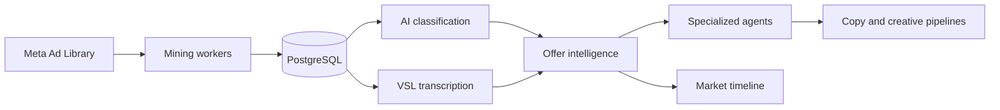

<p align="center">
  
</p>

<h1 align="center">Rafael Florindo</h1>

<p align="center">
  <strong>Automation & AI Engineer</strong><br>
  AI agents · Revenue automation · CRM architecture · APIs · SaaS
</p>

<p align="center">
  <a href="https://www.linkedin.com/in/rafael-florindo">
    
  </a>
  <a href="mailto:rafaelflorindodev@gmail.com">
    
  </a>
  <a href="https://wa.me/5531997900284">
    
  </a>
</p>

---

## About

**I turn fragmented operations into systems that sell, serve, and scale.**

I am an **Automation & AI Engineer based in Brazil**. I build the technical layer behind revenue operations: AI agents, CRM infrastructure, workflow automation, API integrations, internal tools, data products, and multi-tenant SaaS.

At **High Ticket Club**, I work across GoHighLevel, n8n, WhatsApp, AI, and reusable CRM infrastructure. I also contribute as an implementer at **Valente AI**, building client systems, white-label environments, onboarding automation, dashboards, and integrations.

My work connects two layers that are often treated separately:

- **fast operational delivery** with GoHighLevel, n8n, webhooks, and AI services;
- **custom product engineering** with TypeScript, Python, databases, APIs, workers, tests, and production safeguards.

> I do not automate clicks. I engineer systems that qualify, route, follow up, report, and recover when real operations become messy.

<table>
  <tr>
    <td align="center" width="25%">
      <strong>340 tests</strong><br>
      <sub>passing across 47 files<br>in my flagship SaaS</sub>
    </td>
    <td align="center" width="25%">
      <strong>17 workflows</strong><br>
      <sub>in one reusable vertical<br>CRM architecture</sub>
    </td>
    <td align="center" width="25%">
      <strong>~30 calendars</strong><br>
      <sub>mapped in an AI<br>booking operation</sub>
    </td>
    <td align="center" width="25%">
      <strong>55.8% faster</strong><br>
      <sub>result analyzed in my<br>AI productivity research</sub>
    </td>
  </tr>
</table>

---

## Selected engineering work

### 01 · Escaluz — AI offer-intelligence SaaS

`FLAGSHIP PRODUCT` · `PRIVATE CORE` · `ACTIVE DEVELOPMENT`

**Escaluz** turns fragmented advertising research into a structured offer-intelligence workflow. The platform mines the Meta Ad Library, classifies ads, tracks market movements, transcribes VSLs, reconstructs landing pages in isolated environments, models offers with specialized AI agents, and generates creative variations.



**Engineering highlights**

- Multi-tenant ownership boundaries across application routes, APIs, and data access.
- Dedicated workers for mining, media download, transcription, page processing, and FFmpeg jobs.
- Centralized AI-provider cost model, so customers do not need to supply personal API keys.
- Authenticated route coverage, AES-256-GCM secret encryption, SSRF defenses, tracker sanitization, and CSP sandboxing.
- **340 automated tests passing across 47 test files**, verified locally in August 2026.
- Strict TypeScript application with **zero lint errors** in the latest verification.

`Next.js` · `TypeScript` · `Prisma` · `PostgreSQL` · `Supabase` · `Vitest` · `Playwright` · `FFmpeg` · `AI APIs`

---

### 02 · AI + CRM revenue operations

I design GoHighLevel systems as operational architecture: acquisition, qualification, routing, follow-up, booking, sales, onboarding, reporting, and post-sale connected through explicit business rules.

| Selected operation | What was engineered | Scope |
| --- | --- | ---: |
| **Legal services CRM** | Reusable lifecycle architecture organized by responsibility | **17 workflows / 5 folders** |
| **Dental CRM** | Acquisition, follow-up, booking, and operations | **12 workflows** |
| **Aesthetic-services AI** | Procedure and professional triage with calendar routing | **~30 calendars** |
| **Franchise lead management** | Conversation AI, custom fields, scoring, and nurture | **8 scoring levels** |
| **Webinar operation** | WhatsApp, branded email, Stripe, and funnel automation | **9 workflows** |

The reusable system pattern looks like this:

```text
Lead source → GoHighLevel → n8n orchestration → AI agent
            → qualification / routing / booking → sales team
            → CRM history + operational reporting
```

Within this layer, I have also built:

- automated GoHighLevel subaccount provisioning from onboarding data;
- voice-agent flows connecting **VAPI, ElevenLabs, Twilio, n8n, and GoHighLevel**;
- a **7-day outbound call cadence** controlled by CRM events and middleware;
- a sales-call scoring pipeline using recordings, Whisper transcription, structured LLM evaluation, script comparison, and Google Sheets reporting;
- white-label environments for automotive, pool-service, landscaping, contractors, and other local-service operations in Brazil and the United States.

`GoHighLevel` · `Conversation AI` · `Voice AI` · `n8n` · `REST APIs` · `Webhooks` · `WhatsApp` · `Twilio`

---

### 03 · NEW Energy — CRM, AI routing, and executive data

For an energy operation that started without a defined lead-management process, I helped structure CRM stages, generative-AI triage, product routing, and an executive dashboard spanning commercial, marketing, engineering, construction, and operations data.

The result combines native CRM ownership, LLM classification before deterministic routing, n8n and Google Sheets for departments without source systems, and a dedicated **Next.js + Supabase** application for weekly history, trends, status, and KPIs.

[**View the repository →**](https://github.com/RafaellFlorindo/Dashboard-New-Energia) · [**Open the live dashboard →**](https://dashboard-new-energia.vercel.app)

`Next.js` · `TypeScript` · `Supabase` · `Recharts` · `n8n` · `GoHighLevel`

> Most client implementations and the Escaluz core are private. I share system boundaries, architecture, and verifiable engineering evidence without exposing credentials, personal data, internal URLs, or proprietary client logic.

---

## Product lab

I use independent products to explore repeatable business models, AI-native workflows, privacy-first software, and vertical SaaS.

| Product | Purpose | Engineering focus |
| --- | --- | --- |
| [**NotaZen**](https://github.com/RafaellFlorindo/NotaZen) | Offline-capable financial PWA for Brazilian solo entrepreneurs | Local-first data, integer-cent calculations, safe CSV/JSON export, accessibility, Vitest |
| **MatchGoal** | Collaborative football analytics SaaS for the 2026 FIFA World Cup | Next.js, Supabase, n8n integrations, payment infrastructure, product compliance |
| **Low Ticket Machine** | Four-agent pipeline from market research to funnel, content, and paid-media setup | Structured JSON contracts, multi-niche architecture, Astro, automated assets and deployment |
| **Era Uma Vez Você** | AI application that creates personalized content and assembles the final PDF | Next.js 16, React 19, Gemini, pdf-lib, Sharp, Zustand |
| [**Skills for Claude Code**](https://github.com/RafaellFlorindo/Skills-Claude) | Reusable skills for copy, design, SEO, frontend, and review workflows | Knowledge systems, Markdown, AI-assisted engineering |

---

## Research: generative AI × software engineering

I am a Computer Science student at **Univértix**. My thesis analyzes controlled-experiment data comparing conventional development with GitHub Copilot-assisted development.

| Metric | Conventional | Copilot-assisted |
| --- | ---: | ---: |
| Completed observations | 35 | 35 |
| Mean completion time | 160.89 min | 71.17 min |
| Time difference | — | **55.8% faster** |
| Statistical result | — | **p = 0.0017** |
| Functional test difference | — | +7 p.p., not statistically significant |

The defensible conclusion is specific: the dataset provides strong evidence of a speed gain, but not enough evidence to claim a significant improvement in functional quality.

That distinction shapes how I use AI in engineering: **faster generation matters only when testing, maintainability, security, and human review remain inside the system.**

My academic work also includes PageRank and web graphs with Python, DevOps and trunk-based development, IPv6 network labs, and IoT projects.

---

## Core stack

| Domain | Technologies |
| --- | --- |
| **AI & agents** | OpenAI, Gemini, VAPI, ElevenLabs, Twilio, Groq Whisper, structured LLM outputs |
| **Automation & CRM** | n8n, GoHighLevel, Conversation AI, Voice AI, webhooks, scheduled jobs, SaaS Mode |
| **Product engineering** | TypeScript, JavaScript, Next.js, React, Python, FastAPI, Flask, Node.js, Astro |
| **Data & infrastructure** | PostgreSQL, Supabase, Prisma, SQLite, Docker, Linux, Vercel, GitHub Actions |
| **Quality** | Vitest, Playwright, automated testing, security review, linting, visual validation |

---

## How I build

1. **Production over demos** — retries, partial data, API failure, observability, and human intervention are design inputs.
2. **Explicit business logic** — tools may change; the operational contract should not disappear inside platform clicks.
3. **Reusable delivery** — recurring work becomes snapshots, schemas, templates, agents, and tested workflows.
4. **Proof over badge collections** — architecture, tests, working deployments, and clear decisions carry more weight than tool lists.
5. **Cost and security are architecture** — API limits, tenant isolation, infrastructure capacity, privacy, and margin are product constraints.

<details>
<summary><strong>My AI-native engineering workflow</strong></summary>

<br>

I use AI as an execution and review layer, not only as a chat interface.

| Stage | Working model |
| --- | --- |
| **Context** | Obsidian knowledge base, project contracts, structured requirements, and reusable skills |
| **Discovery** | Claude, ChatGPT, and Gemini for research, product structure, copy, and design exploration |
| **Implementation** | Claude Code and Codex for repository work, architecture, refactoring, and tests |
| **Isolation** | Branches and worktrees when parallel execution could create collisions |
| **Verification** | Automated tests, security review, linting, builds, and visual inspection |
| **Learning loop** | Decisions and reusable context return to the knowledge base instead of disappearing into chat history |

The direction is a coordinated multi-agent workflow with explicit ownership, parallel execution, cross-review, automated verification, and controlled integration.

</details>

---

<div align="center">

## Let's build the system behind the idea

If you are working on **AI agents, revenue automation, CRM infrastructure, internal tools, API integrations, or SaaS**, let's talk.

<a href="https://www.linkedin.com/in/rafael-florindo">
  
</a>
<a href="mailto:rafaelflorindodev@gmail.com">
  
</a>
<a href="https://wa.me/5531997900284">
  
</a>

<br><br>

**Rafael Florindo** · `Automation & AI Engineer · Brazil`

</div>

------

[RafaellFlorindo](https://github.com/RafaellFlorindo)

Last Edited on: 26/08/2026
